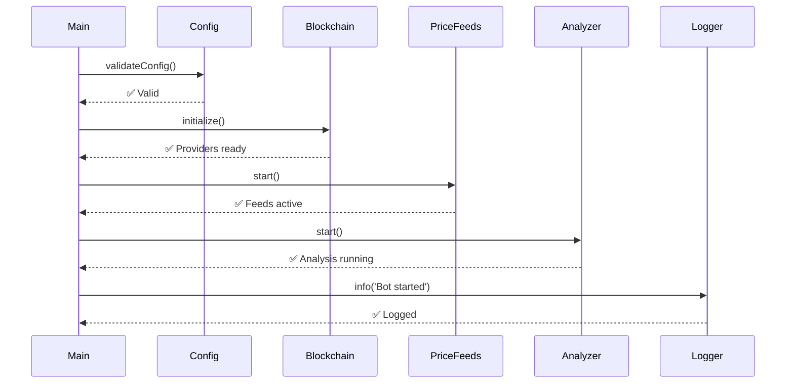
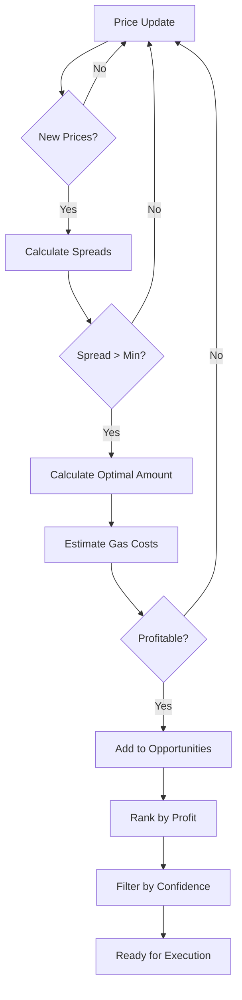
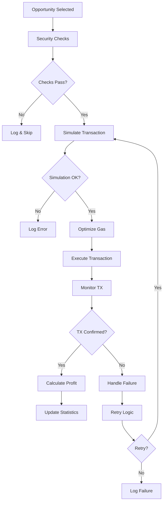

# 🏗️ Architettura Tecnica - Arbitrage Bot

## 📋 Panoramica

Il bot di arbitraggio è progettato con un'architettura modulare e sicura che separa chiaramente le responsabilità e garantisce la massima sicurezza dei fondi. Il sistema è ottimizzato per funzionare su testnet con protezioni integrate contro l'uso accidentale su mainnet.

## 🎯 Principi di Design

### Sicurezza First
- **Nessuna gestione di chiavi private**: Utilizzo esclusivo di MetaMask
- **Protezione testnet**: Controlli multipli anti-mainnet
- **Validazione rigorosa**: Ogni transazione è simulata prima dell'esecuzione
- **Logging sicuro**: Nessun dato sensibile nei log

### Modularità
- **Separazione delle responsabilità**: Ogni modulo ha un compito specifico
- **Interfacce chiare**: API ben definite tra i moduli
- **Testabilità**: Ogni modulo può essere testato indipendentemente
- **Estensibilità**: Facile aggiunta di nuove funzionalità

### Performance
- **Elaborazione asincrona**: Operazioni non bloccanti
- **Cache intelligente**: Riduzione delle chiamate API
- **Ottimizzazione gas**: Calcoli precisi per minimizzare i costi
- **Rate limiting**: Rispetto dei limiti delle API esterne

---

## 🏛️ Architettura del Sistema

```
┌─────────────────────────────────────────────────────────────────────────────┐
│                              ARBITRAGE BOT                                 │
├─────────────────────────────────────────────────────────────────────────────┤
│                                                                             │
│  ┌─────────────────┐    ┌─────────────────┐    ┌─────────────────┐         │
│  │   USER LAYER    │    │   MAIN PROCESS  │    │   CONFIG LAYER  │         │
│  │                 │    │                 │    │                 │         │
│  │ • CLI Interface │    │ • Event Loop    │    │ • Environment   │         │
│  │ • Commands      │    │ • Scheduler     │    │ • Networks      │         │
│  │ • Status        │    │ • Error Handler │    │ • DEX Config    │         │
│  │ • Monitoring    │    │ • Graceful Stop │    │ • Validation    │         │
│  └─────────────────┘    └─────────────────┘    └─────────────────┘         │
│                                                                             │
├─────────────────────────────────────────────────────────────────────────────┤
│                              CORE MODULES                                  │
├─────────────────────────────────────────────────────────────────────────────┤
│                                                                             │
│  ┌─────────────────┐    ┌─────────────────┐    ┌─────────────────┐         │
│  │  BLOCKCHAIN     │    │   PRICE FEEDS   │    │    ANALYZER     │         │
│  │                 │    │                 │    │                 │         │
│  │ • MetaMask      │◄───┤ • DEX APIs      │◄───┤ • Opportunity   │         │
│  │ • RPC Providers │    │ • WebSocket     │    │   Detection     │         │
│  │ • Security      │    │ • Price Cache   │    │ • Profit Calc   │         │
│  │ • Gas Oracle    │    │ • Aggregation   │    │ • Filtering     │         │
│  └─────────────────┘    └─────────────────┘    └─────────────────┘         │
│           │                       │                       │                 │
│           │                       │                       │                 │
│           ▼                       ▼                       ▼                 │
│  ┌─────────────────┐    ┌─────────────────┐    ┌─────────────────┐         │
│  │   EXECUTOR      │    │  TRANSACTION    │    │     LOGGER      │         │
│  │                 │    │                 │    │                 │         │
│  │ • Pre-checks    │◄───┤ • Simulation    │◄───┤ • Secure Log    │         │
│  │ • Execution     │    │ • Gas Optimize  │    │ • File Rotation │         │
│  │ • Monitoring    │    │ • Retry Logic   │    │ • Reporting     │         │
│  │ • Statistics    │    │ • Status Track  │    │ • Alerting      │         │
│  └─────────────────┘    └─────────────────┘    └─────────────────┘         │
│                                                                             │
└─────────────────────────────────────────────────────────────────────────────┘
```

---

## 📦 Dettaglio Moduli

### 🔧 Config Layer (`src/config/`)

**Responsabilità**: Gestione centralizzata della configurazione

```javascript
// config.js
export const config = {
  networks: {
    ethereum: { chainId: 5, name: 'goerli' },
    bsc: { chainId: 97, name: 'bsc-testnet' },
    polygon: { chainId: 80001, name: 'mumbai' }
  },
  dexes: {
    uniswap: { router: '0x...', factory: '0x...' },
    sushiswap: { router: '0x...', factory: '0x...' }
  },
  security: {
    testnetOnly: true,
    maxTransactionAmount: 0.1,
    dailyLimit: 50
  }
};
```

**Caratteristiche**:
- Validazione automatica all'avvio
- Protezioni anti-mainnet integrate
- Configurazione per ambiente (dev/test/prod)
- Hot-reload per sviluppo

### 🔗 Blockchain Layer (`src/blockchain/`)

**Responsabilità**: Gestione connessioni blockchain e wallet

```javascript
// connection.js
class BlockchainConnection {
  async connectMetaMask() {
    // Connessione sicura a MetaMask
    // Validazione rete testnet
    // Event listeners per cambio account/rete
  }
  
  async getProvider(network) {
    // Provider RPC per rete specifica
    // Fallback automatico
    // Rate limiting
  }
  
  async performSecurityChecks() {
    // Verifica modalità testnet
    // Controllo chain ID
    // Validazione wallet
  }
}
```

**Caratteristiche**:
- Connessione non-custodial (MetaMask)
- Multi-provider con fallback
- Controlli di sicurezza automatici
- Gestione eventi wallet

### 💰 Price Feeds (`src/data/`)

**Responsabilità**: Raccolta e gestione dati di prezzo

```javascript
// priceFeeds.js
class PriceFeedManager {
  async fetchDexPrices(token, network) {
    // Chiamate API ai DEX
    // Parsing risposte
    // Validazione dati
  }
  
  async updatePriceCache() {
    // Aggiornamento cache periodico
    // Calcolo prezzi medi
    // Rilevamento anomalie
  }
  
  getCurrentPrice(token, network, source) {
    // Recupero da cache
    // Fallback su API
    // Interpolazione se necessario
  }
}
```

**Fonti Dati**:
- **On-chain**: Uniswap V3 Quoter, Router DEX
- **API**: CoinGecko, 1inch, DEX aggregators
- **WebSocket**: Feed real-time (futuro)

**Cache Strategy**:
- TTL configurabile per token
- Invalidazione su eventi significativi
- Backup su storage locale

### 🔍 Arbitrage Analyzer (`src/analysis/`)

**Responsabilità**: Identificazione e analisi opportunità

```javascript
// arbitrageAnalyzer.js
class ArbitrageAnalyzer {
  async analyzeToken(token, network) {
    // Confronto prezzi cross-DEX
    // Calcolo profitto potenziale
    // Stima costi gas
    // Valutazione rischi
  }
  
  calculateOptimalAmount(opportunity) {
    // Ottimizzazione importo trade
    // Considerazione slippage
    // Limiti liquidità
    // ROI massimo
  }
  
  filterOpportunities(opportunities) {
    // Filtri profittabilità
    // Controlli sicurezza
    // Ranking per confidenza
    // Limiti temporali
  }
}
```

**Algoritmi**:
- **Rilevamento**: Confronto prezzi multi-source
- **Calcolo profitto**: Considerazione gas + slippage
- **Ottimizzazione**: Algoritmi per massimizzare ROI
- **Filtering**: Criteri configurabili di qualità

### ⚡ Transaction Executor (`src/execution/`)

**Responsabilità**: Esecuzione sicura delle transazioni

```javascript
// transactionExecutor.js
class TransactionExecutor {
  async executeArbitrage(opportunity) {
    // Pre-execution checks
    // Transaction simulation
    // Gas optimization
    // Actual execution
    // Post-execution monitoring
  }
  
  async simulateTransaction(params) {
    // Dry-run completo
    // Stima gas accurata
    // Verifica slippage
    // Controlli balance
  }
  
  async monitorTransaction(txHash) {
    // Tracking stato TX
    // Gestione timeout
    // Retry logic
    // Profit calculation
  }
}
```

**Flusso Esecuzione**:
1. **Pre-checks**: Sicurezza, balance, limiti
2. **Simulation**: Test completo senza esecuzione
3. **Optimization**: Gas price, route optimization
4. **Execution**: Invio transazione reale
5. **Monitoring**: Tracking fino a conferma

### 📝 Logging System (`src/utils/`)

**Responsabilità**: Logging sicuro e reportistica

```javascript
// logger.js
class SecureLogger {
  sanitizeMessage(message, data) {
    // Rimozione dati sensibili
    // Pattern matching per chiavi private
    // Mascheramento indirizzi
  }
  
  logArbitrageOpportunity(opportunity) {
    // Log strutturato opportunità
    // Metriche performance
    // Dati per analisi
  }
  
  generateDailyReport() {
    // Report automatico giornaliero
    // Statistiche aggregate
    // Alert anomalie
  }
}
```

**Caratteristiche**:
- **Sicurezza**: Nessun dato sensibile nei log
- **Strutturato**: JSON per analisi automatica
- **Rotazione**: File giornalieri con cleanup
- **Livelli**: Debug, Info, Warning, Error

---

## 🔄 Flussi di Processo

### 🚀 Startup Sequence



### 💹 Arbitrage Detection Flow



### 🔄 Transaction Execution Flow



---

## 🛡️ Sicurezza

### Livelli di Protezione

1. **Environment Level**
   - Variabili ambiente per configurazione
   - Nessuna chiave privata nel codice
   - Modalità testnet forzata

2. **Application Level**
   - Validazione input rigorosa
   - Controlli pre-esecuzione
   - Limiti automatici

3. **Transaction Level**
   - Simulazione obbligatoria
   - Gas optimization
   - Slippage protection

4. **Network Level**
   - Connessioni HTTPS/WSS only
   - Rate limiting
   - Timeout appropriati

### Threat Model

| Minaccia | Mitigazione | Implementazione |
|----------|-------------|----------------|
| **Perdita fondi** | Limiti transazione | `MAX_TRANSACTION_AMOUNT` |
| **Uso mainnet** | Controlli multipli | `NETWORK_MODE=testnet` |
| **MEV attacks** | Gas optimization | Dynamic gas pricing |
| **API manipulation** | Multi-source validation | Cross-reference prices |
| **Rug pulls** | Token whitelist | Configurazione DEX |

---

## 📊 Monitoraggio e Metriche

### Key Performance Indicators (KPIs)

```javascript
const metrics = {
  // Performance
  opportunitiesDetected: 0,
  executionSuccessRate: 0.95,
  averageProfit: 0.002, // ETH
  averageExecutionTime: 15000, // ms
  
  // Security
  securityChecksTriggered: 0,
  simulationFailures: 0,
  dailyTransactionCount: 0,
  
  // System
  uptime: 0.999,
  apiResponseTime: 500, // ms
  cacheHitRate: 0.85
};
```

### Alerting Rules

- **Critical**: Perdite > 1% del capitale
- **Warning**: Success rate < 80%
- **Info**: Nuove opportunità rilevate
- **Debug**: Performance degradation

---

## 🔧 Configurazione Avanzata

### Environment Variables

```bash
# Core Configuration
NETWORK_MODE=testnet                    # testnet|mainnet
WALLET_ADDRESS=0x...                    # Public address only

# RPC Configuration
ETHEREUM_RPC_URL=https://goerli.infura.io/v3/KEY
ETHEREUM_RPC_BACKUP=https://goerli.alchemy.com/v2/KEY
BSC_RPC_URL=https://data-seed-prebsc-1-s1.binance.org:8545
POLYGON_RPC_URL=https://rpc-mumbai.maticvigil.com

# Trading Parameters
MIN_PROFIT_PERCENTAGE=2.0               # Minimum profit threshold
MAX_TRANSACTION_AMOUNT=0.1              # Maximum per transaction
SLIPPAGE_TOLERANCE=1.0                  # Slippage tolerance %
MAX_GAS_PRICE=20                        # Max gas price (Gwei)

# Security Settings
ENABLE_SECURITY_CHECKS=true             # Enable all security checks
ENABLE_SIMULATION=true                  # Simulate before execution
DAILY_TRANSACTION_LIMIT=50              # Max transactions per day

# API Keys
COINGECKO_API_KEY=your_key_here
ONEINCH_API_KEY=your_key_here
MORALIS_API_KEY=your_key_here

# Monitoring
LOG_LEVEL=info                          # debug|info|warn|error
ENABLE_FILE_LOGGING=true                # Enable file logging
LOG_DIRECTORY=./logs                    # Log directory

# Performance
PRICE_UPDATE_INTERVAL=5000              # Price update interval (ms)
API_TIMEOUT=10000                       # API timeout (ms)
PRICE_CACHE_TTL=30000                   # Price cache TTL (ms)
```

### DEX Configuration

```javascript
const dexConfig = {
  uniswap: {
    name: 'Uniswap V3',
    router: '0xE592427A0AEce92De3Edee1F18E0157C05861564',
    quoter: '0xb27308f9F90D607463bb33eA1BeBb41C27CE5AB6',
    fee: 3000, // 0.3%
    networks: ['ethereum', 'polygon']
  },
  sushiswap: {
    name: 'SushiSwap',
    router: '0x1b02dA8Cb0d097eB8D57A175b88c7D8b47997506',
    factory: '0xc35DADB65012eC5796536bD9864eD8773aBc74C4',
    fee: 3000,
    networks: ['ethereum', 'bsc', 'polygon']
  }
};
```

---

## 🚀 Deployment

### Development Environment

```bash
# Setup
npm install
npm run setup

# Development
npm run dev        # Hot reload
npm run test       # Run tests
npm run lint       # Code linting
```

### Production Environment

```bash
# Build
npm run build

# Production
npm start          # Production mode
npm run monitor    # With monitoring
```

### Docker Deployment

```dockerfile
FROM node:18-alpine
WORKDIR /app
COPY package*.json ./
RUN npm ci --only=production
COPY src/ ./src/
EXPOSE 3000
CMD ["npm", "start"]
```

---

## 🔮 Roadmap Futuro

### Fase 1: Core Stability
- ✅ Architettura base
- ✅ Sicurezza testnet
- ✅ Multi-DEX support
- 🔄 Testing completo

### Fase 2: Advanced Features
- 📋 WebSocket real-time feeds
- 📋 Advanced MEV protection
- 📋 Machine learning per prediction
- 📋 Web dashboard

### Fase 3: Scale & Optimize
- 📋 Multi-chain simultaneo
- 📋 Liquidity aggregation
- 📋 Advanced order types
- 📋 API pubblica

### Fase 4: Enterprise
- 📋 Multi-user support
- 📋 Risk management avanzato
- 📋 Compliance tools
- 📋 Audit trail completo

---

## 📚 Risorse Aggiuntive

- **Documentazione API**: `/docs/api.md`
- **Guide Sviluppatore**: `/docs/developer.md`
- **Troubleshooting**: `/docs/troubleshooting.md`
- **Security Best Practices**: `SECURITY_CHECKLIST.md`
- **Contributing Guidelines**: `CONTRIBUTING.md`

---

**⚠️ Disclaimer**: Questa architettura è progettata per uso educativo e di test. Prima dell'uso in produzione su mainnet, è obbligatorio un audit completo di sicurezza.